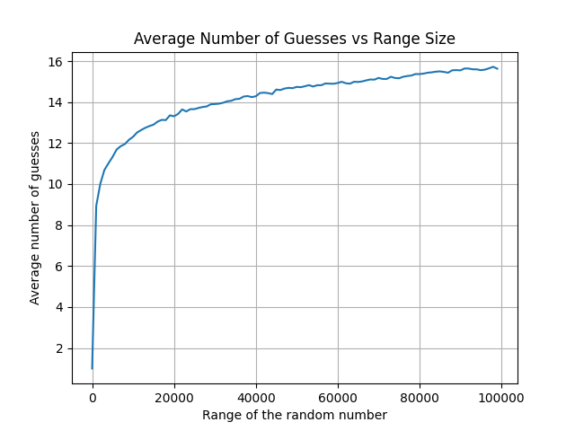

# Smart Guesser – AI Number Guesser

This project is a simple AI simulation where an agent learns to guess a number chosen randomly within a given range. The AI uses a basic learning strategy to improve its guesses over multiple simulations, and the results are displayed as a graph showing the average number of guesses for different ranges.

---

## How it works

1. **Engine**: generates a random number within the specified range.
2. **Agent**: tries to guess the number and updates its strategy based on feedback (`higher`, `lower`, or `correct`).
3. **Simulation**: the program runs multiple games to calculate the average number of guesses for a given range.
4. **Graph**: displays how the average number of guesses increases with the range size.

The graph typically follows a logarithmic curve, which is expected because the optimal guessing strategy (binary search) grows with log₂(range).

---

## How to use

You can change these constants in `main.py` to modify the simulation:

```python
TOTAL_SIMULATION = 100      # Number of different range simulations
AVERAGE_SIMULATION = 1000   # Number of games per range

STARTING_RANGE = 1          # Starting maximum number
RANGE_INCREMENT = 1000      # How much to increase the range for each simulation
```

With these values, you will get a graph similar to the one below:




## Requirements

* Python 3.8+
* matplotlib (`pip install matplotlib`)

---

## Running the project

```bash
python main.py
```

This will run the simulations and generate a graph showing the AI's performance.

---

## Notes

* The AI uses a simple “guess the middle of the range” strategy, which is optimal for a number guessing game.
* You can modify the agent or implement more advanced learning algorithms to see how the AI improves over time.
